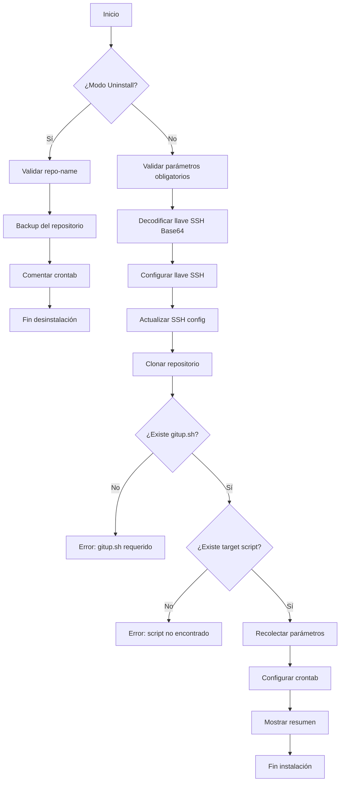
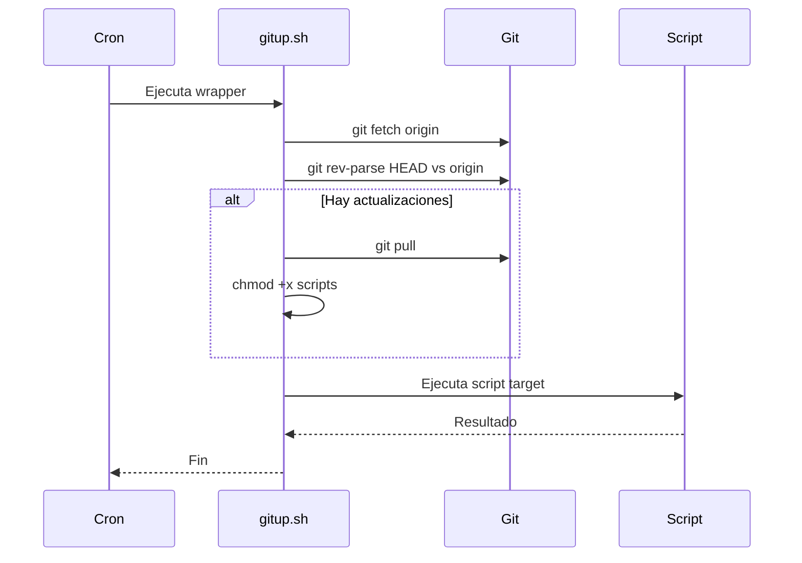

# Manual de Uso - gitinstall.sh

## Descripción General

**gitinstall.sh** es un instalador automático de repositorios Git diseñado para trabajar con `gitup.sh` como wrapper. Este script gestiona de forma integral:

- Configuración de llaves SSH para acceso seguro
- Clonación de repositorios Git
- Configuración automática de crontab para ejecución programada
- Recolección interactiva de parámetros del script target

## Requisitos Previos

| Requisito | Descripción |
|-----------|-------------|
| **Sistema Operativo** | Linux (Debian, Ubuntu, RHEL, CentOS, SUSE, Alpine, Arch) |
| **Privilegios** | Root o sudo para instalación en `/usr/local/bin` |
| **Git** | Se instala automáticamente si no está disponible |
| **Bash** | Versión 4+ |
| **Repositorio** | Debe contener `gitup.sh` y el script target |

---

## Sintaxis Básica

```bash
gitinstall.sh [opciones] [-- parámetros_extra_para_script]
```

---

## Parámetros

### Parámetros Obligatorios

| Parámetro | Descripción | Ejemplo |
|-----------|-------------|---------|
| `--ssh-key-b64 <key>` | Llave SSH privada codificada en Base64 | `--ssh-key-b64 "$(cat ~/.ssh/deploy \| base64 -w0)"` |
| `--repo-url <url>` | URL SSH del repositorio Git | `--repo-url git@github.com:org/repo.git` |
| `--target-script <name>` | Nombre del script que ejecutará gitup.sh | `--target-script sysinv.sh` |

### Parámetros Opcionales

| Parámetro | Descripción | Valor por defecto |
|-----------|-------------|-------------------|
| `--key-name <name>` | Nombre del archivo de llave SSH | `deploy` |
| `--install-dir <path>` | Directorio de instalación | `/usr/local/bin` |
| `--log-dir <path>` | Directorio de logs | `/var/log` |
| `--cron-schedule <cron>` | Programación cron (si no se indica, se pregunta interactivamente) | - |
| `--update-only` | Configura cron solo para actualizar el repo (sin ejecutar script) | `false` |
| `--repo-name <name>` | Nombre personalizado del directorio del repositorio | Nombre del repo |
| `--required-params <p>` | Lista de parámetros obligatorios separados por coma | - |
| `--<param> <valor>` | Valor para un parámetro definido en `--required-params` | - |

### Parámetros de Desinstalación

| Parámetro | Descripción |
|-----------|-------------|
| `--uninstall` | Activa el modo desinstalación |
| `--repo-name <name>` | Nombre del repositorio a desinstalar (requerido con `--uninstall`) |

### Otros

| Parámetro | Descripción |
|-----------|-------------|
| `-h`, `--help` | Muestra la ayuda completa |
| `--` | Separador para parámetros extra del script target |

---

## Modos de Uso

### 1. Instalación Interactiva

Este modo pregunta interactivamente por los parámetros no proporcionados y la programación cron.

```bash
curl -sSL https://raw.githubusercontent.com/org/repo/main/gitinstall.sh | sudo bash -s -- \
    --ssh-key-b64 "$(cat ~/.ssh/deploy | base64 -w0)" \
    --repo-url git@github.com:smarting/inventory.git \
    --target-script sysinv.sh \
    --required-params "youtrack-base,youtrack-infra"
```

**El script preguntará:**
- Valores para cada parámetro definido en `--required-params`
- La programación cron deseada

### 2. Instalación No Interactiva

Proporciona todos los parámetros en la línea de comandos para una instalación completamente automática.

```bash
sudo ./gitinstall.sh \
    --ssh-key-b64 "$(cat ~/.ssh/deploy | base64 -w0)" \
    --repo-url git@github.com:smarting/inventory.git \
    --target-script sysinv.sh \
    --key-name inventory-deploy \
    --cron-schedule "0 6,12,18 * * *" \
    --required-params "youtrack-base,youtrack-infra" \
    --youtrack-base BDC-A-729 \
    --youtrack-infra V2 \
    -- --no-warnings
```

### 3. Desinstalación

```bash
sudo ./gitinstall.sh --uninstall --repo-name inventory
```

**Acciones realizadas:**
- Crea backup del repositorio con timestamp (`repo.uninstall.YYYYMMDD_HHMMSS`)
- Comenta las entradas relacionadas en crontab (no las elimina)
- **No elimina:** llaves SSH ni configuración SSH (por seguridad)

### 4. Instalación Solo Actualización (--update-only)

Este modo es ideal para **deployments con Ansible** u otros sistemas de orquestación donde:
- El script se ejecuta mediante Ansible (no cron)
- El cron solo debe mantener el repositorio actualizado

```bash
sudo ./gitinstall.sh \
    --ssh-key-b64 "$(cat ~/.ssh/deploy | base64 -w0)" \
    --repo-url git@github.com:smarting/inventory.git \
    --target-script sysinv.sh \
    --key-name deploy \
    --install-dir /home/ansible/ansible_sysinv \
    --repo-name files \
    --cron-schedule "0 3 * * *" \
    --update-only
```

**Resultado:**
- Repositorio clonado en: `/home/ansible/ansible_sysinv/files/`
- Cron ejecuta: `gitup.sh --update-only` (solo actualiza, no ejecuta script)
- Log en: `/var/log/sysinv.log`

> [!TIP]
> Use `--repo-name` junto con `--install-dir` para personalizar completamente la ruta de instalación.

---

## Programación Cron

### Formato

```
MIN HORA DIA MES DIA_SEMANA
```

| Campo | Rango | Descripción |
|-------|-------|-------------|
| MIN | 0-59 | Minutos |
| HORA | 0-23 | Horas |
| DIA | 1-31 | Día del mes |
| MES | 1-12 | Mes |
| DIA_SEMANA | 0-7 | 0 y 7 = domingo, 1 = lunes, etc. |

### Comodines

| Comodín | Significado | Ejemplo |
|---------|-------------|---------|
| `*` | Cualquier valor | `* * * * *` = cada minuto |
| `*/N` | Cada N unidades | `*/5 * * * *` = cada 5 minutos |
| `N,M` | Lista de valores | `0,30 * * * *` = a las :00 y :30 |
| `N-M` | Rango | `1-5` = lunes a viernes |

### Ejemplos Comunes

| Expresión | Significado |
|-----------|-------------|
| `*/5 * * * *` | Cada 5 minutos |
| `0 * * * *` | Cada hora (en punto) |
| `0 */2 * * *` | Cada 2 horas |
| `0 */6 * * *` | Cada 6 horas |
| `0 6 * * *` | Diariamente a las 6:00 |
| `0 6,12,18 * * *` | A las 6:00, 12:00 y 18:00 |
| `30 7 * * *` | Diariamente a las 7:30 |
| `0 8 * * 1-5` | Lunes a viernes a las 8:00 |
| `0 6 * * 1` | Cada lunes a las 6:00 |
| `0 0 1 * *` | El día 1 de cada mes a medianoche |

---

## Flujo de Instalación



---

## Estructura de Archivos

Tras una instalación exitosa, la estructura será:

```
/usr/local/bin/
└── <repo-name>/
    ├── gitup.sh          # Wrapper de auto-actualización
    ├── <target-script>   # Script principal
    └── (otros archivos del repositorio)

~/.ssh/
├── config               # Actualizado con alias SSH
└── <key-name>           # Llave SSH privada

/var/log/
└── <target-script>.log  # Archivo de logs
```

---

## Configuración SSH

### Alias SSH

gitinstall.sh crea un alias SSH único para cada instalación. Esto permite:

- Múltiples repositorios usando el mismo host Git
- Diferentes llaves SSH para diferentes repositorios
- Aislamiento entre configuraciones

**Formato del alias:** `<git-host>-<key-name>`

**Ejemplo de entrada en `~/.ssh/config`:**

```
# Añadido por gitinstall.sh - 2024-01-15 10:30:00 - inventory
Host github.com-deploy
    HostName github.com
    User git
    IdentityFile /root/.ssh/deploy
    IdentitiesOnly yes
    StrictHostKeyChecking accept-new
```

---

## Gestión de Conflictos

### Llave SSH existente

| Situación | Acción |
|-----------|--------|
| Llave idéntica | Reutiliza la existente |
| Llave diferente | **Error**: Usar `--key-name` con nombre diferente |

### Repositorio existente

| Situación | Acción |
|-----------|--------|
| Directorio existe | Crea backup con timestamp y clona de nuevo |

### Entrada crontab existente

| Situación | Acción |
|-----------|--------|
| Entrada para mismo script | Comenta la anterior (prefijo `# OLD:`) y añade nueva |

---

## Comandos Útiles Post-Instalación

| Acción | Comando |
|--------|---------|
| Ver crontab | `crontab -l` |
| Ver logs | `tail -f /var/log/<script>.log` |
| Ejecutar manualmente | `/usr/local/bin/<repo>/gitup.sh ./<script>.sh` |
| Editar crontab | `crontab -e` |
| Verificar SSH | `ssh -T git@<host>-<key-name>` |

---

## Mensajes de Error Comunes

| Error | Causa | Solución |
|-------|-------|----------|
| `Falta parámetro obligatorio: --ssh-key-b64` | No se proporcionó la llave SSH | Añadir `--ssh-key-b64 "$(cat key \| base64 -w0)"` |
| `No se pudo decodificar la llave SSH` | Base64 inválido | Verificar codificación con `cat key \| base64 -w0 \| base64 -d` |
| `La llave SSH ya existe pero es DIFERENTE` | Conflicto de llaves | Usar `--key-name` diferente |
| `No se encontró gitup.sh en el repositorio` | Repositorio incompleto | Añadir gitup.sh al repositorio |
| `No se encontró el script target` | Script target no existe | Verificar nombre del script |
| `Formato cron inválido` | Menos de 5 campos | Revisar formato cron |

---

## Ejemplos Completos

### Ejemplo 1: Instalación de Inventario de Sistema

```bash
# Generar llave SSH para deploy
ssh-keygen -t ed25519 -f ~/.ssh/inventory-deploy -N ""

# Añadir llave pública al repositorio en GitHub/GitLab

# Instalar
curl -sSL https://raw.githubusercontent.com/smarting/inventory/main/gitinstall.sh | sudo bash -s -- \
    --ssh-key-b64 "$(cat ~/.ssh/inventory-deploy | base64 -w0)" \
    --repo-url git@github.com:smarting/inventory.git \
    --target-script sysinv.sh \
    --key-name inventory-deploy \
    --cron-schedule "0 8,14,20 * * *" \
    --required-params "youtrack-base,youtrack-infra,youtrack-platform,youtrack-env" \
    --youtrack-base BDC-A-729 \
    --youtrack-infra V2 \
    --youtrack-platform ATM \
    --youtrack-env PRO
```

### Ejemplo 2: Instalación con Parámetros Interactivos

```bash
sudo ./gitinstall.sh \
    --ssh-key-b64 "$(cat ~/.ssh/deploy | base64 -w0)" \
    --repo-url git@gitlab.com:company/scripts.git \
    --target-script monitor.sh \
    --required-params "environment,region"
```

El script preguntará por:
1. Valor para `--environment`
2. Valor para `--region`
3. Programación cron

### Ejemplo 3: Desinstalar y Reinstalar

```bash
# Desinstalar
sudo ./gitinstall.sh --uninstall --repo-name inventory

# Reinstalar con nueva configuración
sudo ./gitinstall.sh \
    --ssh-key-b64 "$(cat ~/.ssh/deploy | base64 -w0)" \
    --repo-url git@github.com:smarting/inventory.git \
    --target-script sysinv.sh \
    --cron-schedule "0 6 * * *"
```

### Ejemplo 4: Instalación para Ansible (Solo Actualización)

```bash
# Instalar en directorio de Ansible, cron solo actualiza
curl -sSL https://raw.githubusercontent.com/smartingrepo/install/main/gitinstall.sh | bash -s -- \
    --ssh-key-b64 "$(cat ~/.ssh/deploy | base64 -w0)" \
    --repo-url git@github.com:smartingrepo/inventory.git \
    --target-script sysinv.sh \
    --key-name deploy \
    --install-dir /home/ansible/ansible_sysinv \
    --repo-name files \
    --cron-schedule "0 3 * * *" \
    --update-only
```

**Resultado:**
- Scripts disponibles en `/home/ansible/ansible_sysinv/files/`
- Cron a las 3:00 AM actualiza el repositorio
- Ansible ejecuta los scripts de forma independiente

---

## Consideraciones de Seguridad

> [!WARNING]
> **Llave SSH**: La llave privada se almacena en `~/.ssh/<key-name>`. Asegúrese de que solo root tenga acceso.

> [!IMPORTANT]
> **Permisos**: El script establece automáticamente permisos 600 para la llave SSH y el archivo de configuración.

| Archivo | Permisos | Propietario |
|---------|----------|-------------|
| `~/.ssh/<key-name>` | 600 | root |
| `~/.ssh/config` | 600 | root |
| Repositorio | 755 | root |

---

## Funcionamiento de gitup.sh

`gitinstall.sh` trabaja en conjunto con `gitup.sh`, que es el wrapper de auto-actualización. El flujo de ejecución del cron es:



---

## Troubleshooting

### El script no se ejecuta en cron

1. Verificar entrada en crontab: `crontab -l | grep <script>`
2. Verificar logs: `tail -f /var/log/<script>.log`
3. Ejecutar manualmente: `/usr/local/bin/<repo>/gitup.sh ./<script>.sh`

### Error de SSH al clonar

1. Verificar llave SSH: `ls -la ~/.ssh/<key-name>`
2. Verificar config SSH: `cat ~/.ssh/config | grep -A5 <host>`
3. Probar conexión: `ssh -vT git@<host>-<key-name>`

### El repositorio no se actualiza

1. Verificar conectividad SSH
2. Revisar logs de gitup.sh
3. Ejecutar `git fetch` manualmente en el directorio del repo

---

## Changelog

| Versión | Fecha | Cambios |
|---------|-------|---------|
| 1.1 | 2024-12 | Añadido `--update-only` para modo solo actualización, `--repo-name` para nombre personalizado |
| 1.0 | 2024 | Versión inicial |

---

## Soporte

Para reportar problemas o sugerencias, contactar al equipo de infraestructura o crear un ticket en YouTrack.
